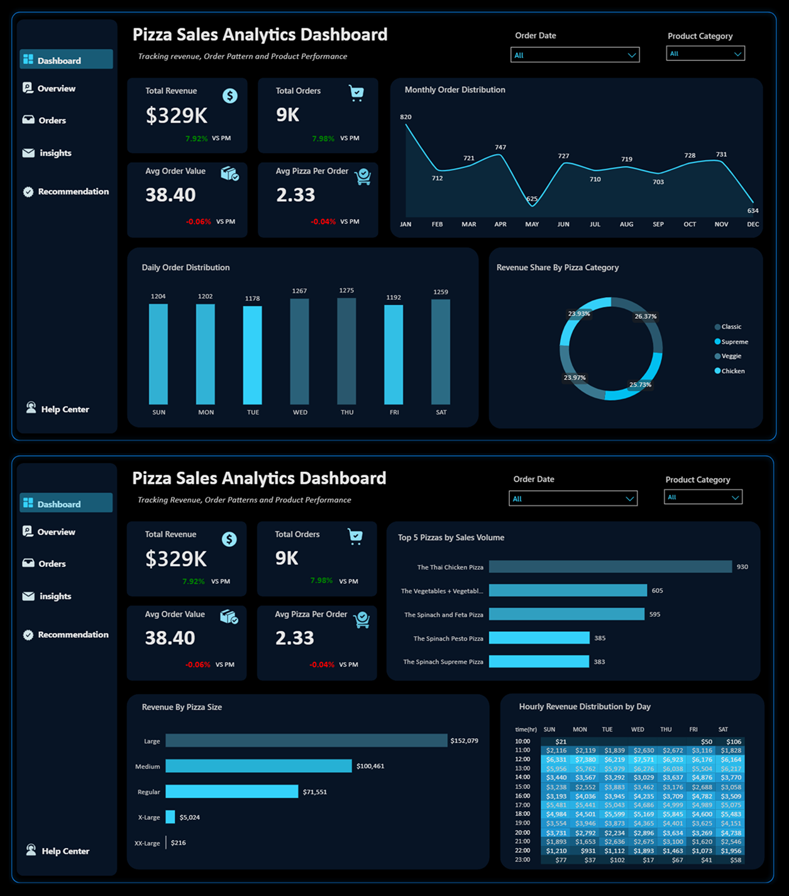

# 🍕 Pizza Sales & Operational Performance Analysis

An end-to-end data analysis project evaluating sales trends, customer purchasing behaviors, peak demand windows, and product performance using Power Query, Microsoft Excel, and Power BI.

---

## 🖥️ Dashboard Overview

---

##  Introduction

### Project Overview
This project presents an end-to-end data analytics and business intelligence study evaluating **$329K in transactional sales** across **9,000 orders** for a quick-service pizza business. Operating within a fast-casual dining framework where speed, menu efficiency, and high throughput drive success, this study analyzes historical point-of-sale (POS) data to uncover revenue drivers, evaluate customer basket economics, map temporal demand patterns, and provide actionable business recommendations.

### Business Problem
While total order volume shows steady month-over-month growth, the business faces key operational and financial challenges:
1. **Contraction in Basket Spend:** Average Order Value (AOV) sits at **$38.40** with an average basket size of **~2 pizzas per transaction**, indicating that growth is currently volume-driven rather than value-driven.
2. **Operational Demand Imbalance:** Demand surges heavily during specific hourly windows and weekend days, while mid-week shifts (particularly Tuesdays) experience significant underutilization.
3. **Menu Sizing Inefficiencies:** Inventory and prep overhead are spread across multiple size formats, yet revenue is heavily concentrated in a single size tier.

### Core Objectives
* **Revenue & Category Analysis:** Determine top-performing items, revenue distribution across categories, and sizing choices.
* **Temporal & Capacity Mapping:** Analyze hourly, daily, and monthly demand trends to optimize labor scheduling and kitchen prep.
* **Basket Economics Optimization:** Identify strategies to increase AOV and item counts per basket.
* **Strategic Recommendations:** Provide data-backed operational, marketing, and menu strategies to increase revenue and smooth demand.

---

## Tools Used

* **Power Query Editor:** Used for data extraction, cleaning, handling nulls/empty entries, renaming promo code categories, and applying structural transformations without altering total revenue integrity.
* **Microsoft Excel:** Applied DAX functions and dynamic Pivot Tables to perform aggregated metrics modeling, calculate Average Order Value (AOV), and assess month-over-month (MoM) growth rates.
* **Power BI:** Built an interactive executive dashboard featuring time-series analysis, revenue share distributions, peak demand heatmaps, and cross-filtering visuals for operational decision-making.

---

## Story of Data

* **Data Source:** Relational Point of Sale (POS) transactional database logs.
* **Data Collection Process:** Real-time transactional logging captured at point-of-purchase counters and online ordering systems.
* **Data Structure:** Granular transaction lines capturing:
  * **Order Identifiers:** Unique Order ID grouping items per basket.
  * **Temporal Attributes:** Order Date, Order Time, Day of Week, Month-Year.
  * **Product Attributes:** Pizza Name, Category (Classic, Supreme, Veggie, Chicken), Size (S, M, L, XL, XXL).
  * **Financial Metrics:** Unit Price, Quantity, Total Calculated Price.
* **Data Limitations:**
  * **Lack of Customer Identifiers:** Absence of unique customer IDs prevents cohort retention, repeat-buyer rate, and Customer Lifetime Value (LTV) analysis.
  * **Absence of Cost Data:** Dataset contains top-line gross revenue only without Cost of Goods Sold (COGS), limiting evaluation to sales volume rather than net profitability margins.

---

## Data Splitting & Preprocessing

### Data Cleaning & Integrity
Data cleaning operations were completed in **Power Query Editor** prior to analysis:
* Executed data type transformations across numerical, date/time, and text columns.
* Renamed empty space entries in promo/coupon code fields to standardized categorical labels rather than deleting records, maintaining total revenue integrity.
* Verified zero duplicate orders in the cleaned dataset to prevent double-counting transaction volumes.

### Transformations & Feature Engineering
* Generated custom temporal attributes: **Day Name**, **Hour Buckets**, and **Month-Year** fields.
* Built aggregation metrics and DAX explicit measures for Total Revenue ($329K), Total Orders (9,000), MoM Growth Rate (7–8%), and Average Order Value ($38.40).

### Data Variables
* **Dependent Variable:** Total Revenue / Order Value.
* **Independent Variables:** Pizza Category, Pizza Size, Quantity, Time of Day, Day of Week, Month.

---

##  Key Business Insights

### Order Economics
* **Total Revenue:** $329K
* **Total Orders:** 9,000 (9K)
* **Average Order Value (AOV):** $38.40
* **Average Basket Size:** ~2 pizzas per order
* **MoM Growth:** 7–8% steady expansion

### Product & Sizing Performance
* **Top Selling Item:** **Thai Chicken Pizza** leads overall sales volume.
* **Category Balance:** Revenue is evenly spread across Classic, Supreme, Veggie, and Chicken lines, showing strong portfolio diversification without single-category dependency.
* **Size Preference:** **Large (L)** pizzas drive ~65% of overall revenue. **XL** and **XXL** sizes contribute minimally.

### Temporal & Capacity Patterns
* **Peak Hours:** Two distinct operational surges occur during Lunch (**12:00 PM – 2:00 PM**) and Dinner (**5:00 PM – 8:00 PM**).
* **Weekly Pattern:** Order volume builds from **Thursday through Saturday**. **Tuesday** is consistently the lowest-performing day.
* **Monthly Pattern:** Revenue peaks in **January**, **April**, and **October–November**, with a distinct slowdown in **May**.

---

##  Actionable Recommendations

### 1. Increase Ticket Size (Lift AOV beyond $38.40)
* **Cross-Selling Prompts:** Implement automated checkout prompts for high-margin sides, drinks, or desserts (e.g., *"Add a beverage and side for $3.00"*).
* **Strategic Bundling:** Create family or group combo meals pairing top sellers (like **Thai Chicken**) with secondary items to push basket size above 2 pizzas.

### 2. Activate Mid-Week Demand (Fix Tuesday Lulls)
* **Targeted Mid-Week Offers:** Launch app-exclusive or Tuesday-only promotions (e.g., *"Buy One Get One 50% Off on Tuesdays"*) to monetize underutilized mid-week kitchen capacity.

### 3. Operational & Labor Scheduling
* **Peak Hour Labor Alignment:** Restructure staffing shifts and prep routines tightly around the **12–2 PM** and **5–8 PM** windows, prioritizing kitchen throughput from **Thursday to Saturday**.

### 4. Menu & Inventory Streamlining
* **Re-evaluate Sizing Strategy:** Focus marketing primarily on Large size options and evaluate sunsetting or re-packaging underperforming XL/XXL sizes to simplify inventory management.

---

##  Conclusion & Future Scope

### Conclusion
The business demonstrates strong operational fundamentals with **$329K in revenue**, **9,000 orders**, and steady **7–8% MoM growth**. Strategic focus should shift from pure transaction acquisition toward expanding individual ticket spend (AOV) and capturing underutilized mid-week capacity.

### Future Scope
* **Loyalty Program Integration:** Introduce unique customer tracking IDs to measure repeat purchase rates and customer lifetime value (LTV).
* **Margin & Profitability Modeling:** Merge ingredient cost data (COGS) with sales velocity to analyze net profit margins by pizza category.
